# 🚀 Flow Pipline Olist Brazilion E-commerce

Pengolahan data E-commerce Brazilion ini menggunakan **Python (PySpark)** yang menerapkan konsep ETL (Extract Transform Load), untuk data source menggunakan file dengan format csv kemudian di ingestion ke data-lake menggunkana **MINIO**. Proyek ini menggunakan konsep **Medallion architecture** dan **Trino Engine** sebagai pengolah data minio yang sudah di transform, untuk data visualisasi menggunakan **Metabase**.

## ✨ Tools yang digunakan
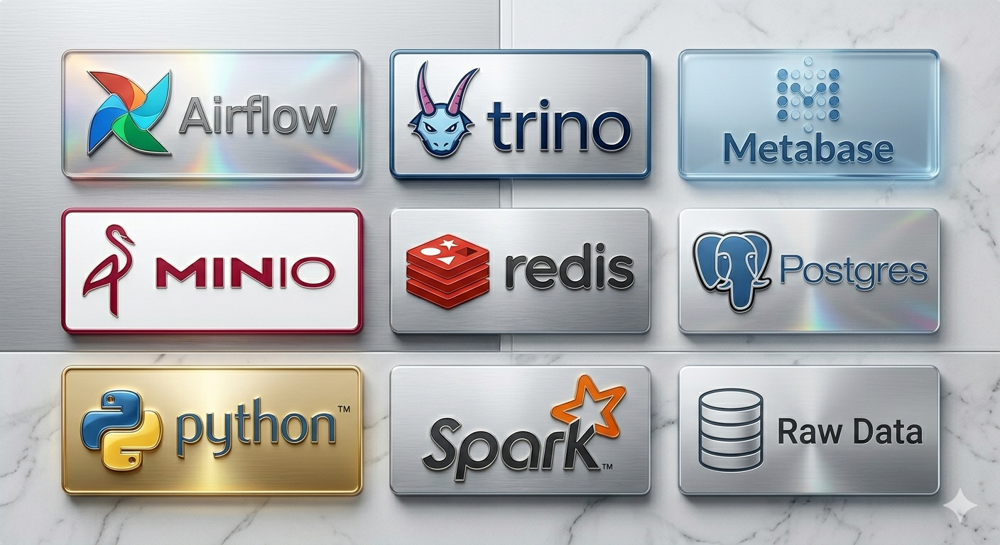

## 🛠️ Tools yang digunakan
* **Language**: Python
* **Workflow Orchestration**: Apache Airflow
* **Distributed Processing**: PySpark 3.5.0
* **Object Storage**: MinIO
* **Database**: PostgreSQL
* **Data Manipulation**: Spark SQL
* **Environment Management**: Python Dotenv
* **Database Driver**: Psycopg2 Binary
* **Containerization**: Docker & Docker Compose

## 🚀 Cara Menjalankan (Quick Start)
Pastikan kamu sudah menginstall **Docker** dan **Docker Compose** di laptopmu.

1. **Clone Repositori**
   ```bash
    https://github.com/AgustiBayuSamudro/e-commerce-olist.git

2. **Masukan data raw Olist Brazilion E-commerce pada folder**
   ``` bash
    └── E-COMMERCE-OLIST/
        └── data/
            └── raw/
                └── olist brazilion e-commerce.csv
3. **Build dan jalankan docker**
   ``` bash
   docker compose up --build -d
4. **Di sini saya menggunakan vps, jika tidak bisa ganti vps dengan localhost**
   ``` bash
   http://103.196.155.168 atau http://localhost
* **MINIO**
    ``` bash
    http://103.196.155.168:9001/
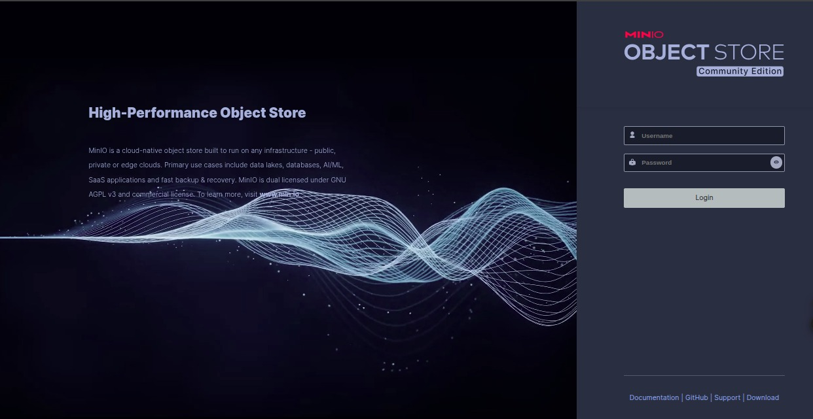
* **AIRFLOW**
    ``` bash
    http://103.196.155.168:8080/

* **SPARK**
    ``` bash
    http://103.196.155.168:8081/
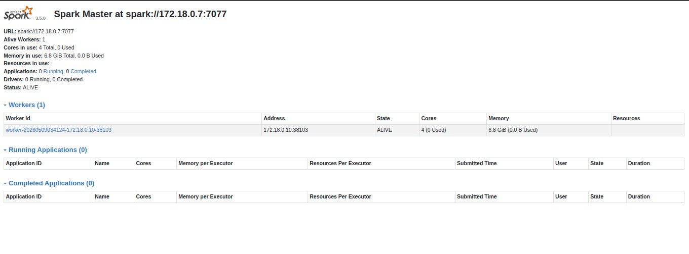
* **METABASE**
    ``` bash
    http://103.196.155.168:8082/
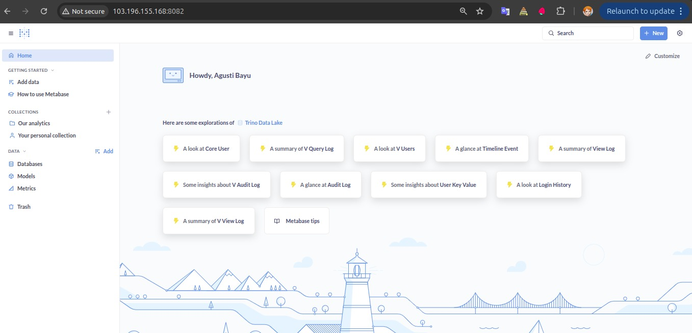
5. **Buat scema pada trino engine**
Struktur schema pada engine Trino yang mengelola data di MinIO:

## 🧪 Cara Pengujian (Testing)
1. **Buat data-lake minio**

2. **Buat Koneksi spark-master di airflow**
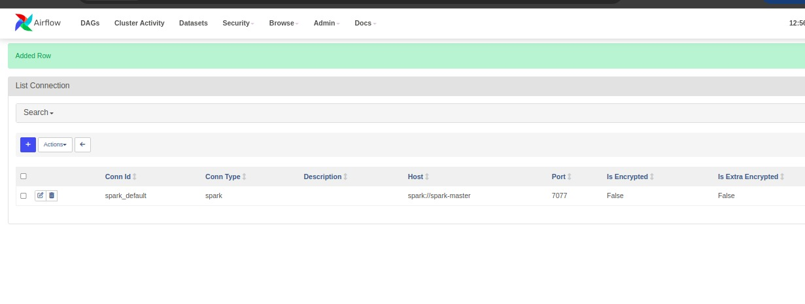
3. **Jalankan airflow**
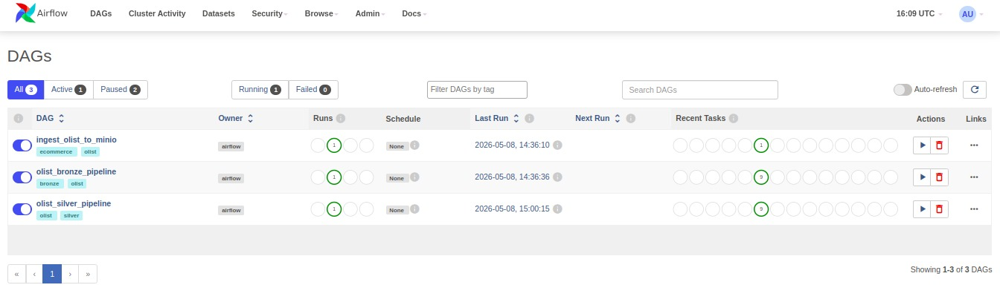
4. **Buat db metabase**
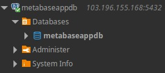
5. **Jalankan query sql pada folder assets di trino engine**
    ``` bash
    └── E-COMMERCE OLIST/
        └── assets/
            ├── images/
            └── sql/
                ├── bronze/
                ├── silver/
                └── gold/
6. **Cek view diagram**
* **bronze**
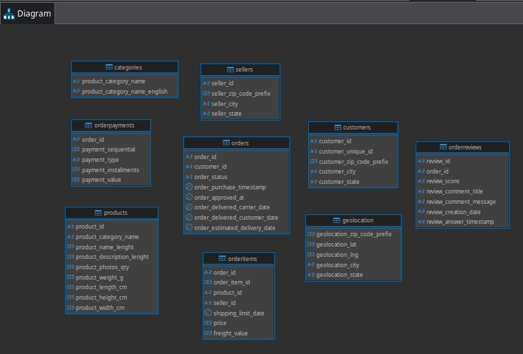
* **silver**
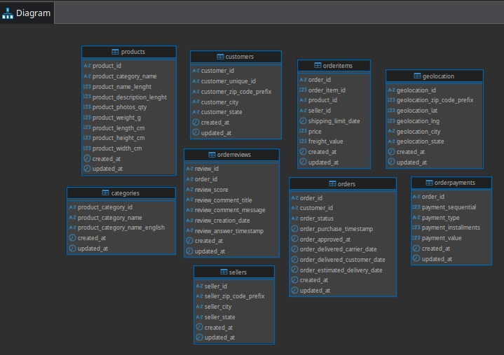
* **gold**
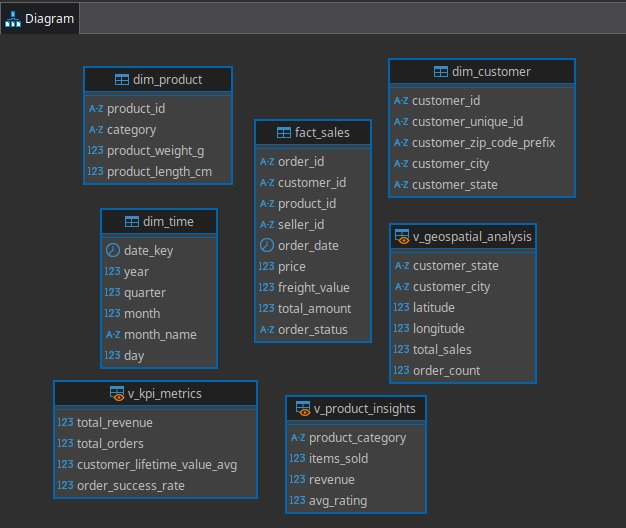
7. **Visualisasi Metabase**
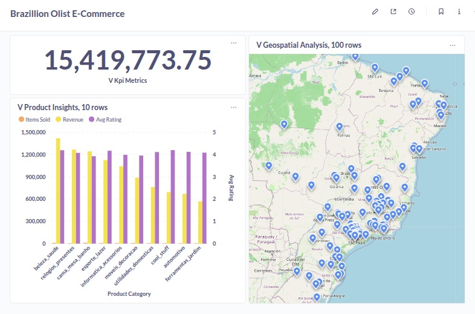
8. **Selamat sudah berhasil melakukan pemrosesan data**
